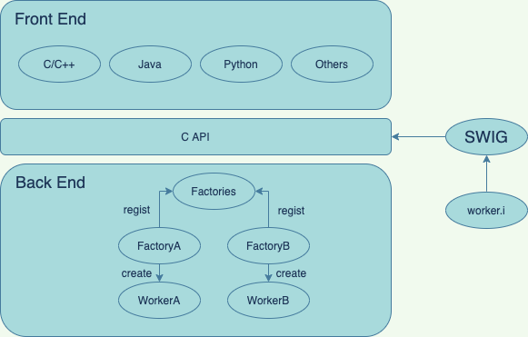

# Arch

# Front back separation features
1. SWIG(Simplified Wrapper and Interface Generator, swig.org), Front and back ends separated by [swig](https://github.com/swig/swig)
2. C++ is core, which realizes specific functions
3. APIs and specific function realization separated by factory mode

# Demo

## Python
1. swig -c++ -python -o worker_wrap.cxx worker.i
2. mv api/worker_wrap.cxx impl/
3. bazel build //impl:_worker.so
4. mv bazel-bin/impl/_worker.so ./
5. python python_test.py

## Java
1. swig -c++ -java -package com.simple.front_back_separation -o java_simple_worker.cxx -outdir ./java_swig/ worker.i
2. mv java_simple_worker.cxx impl/
3. modify WORKSPACE for java headers dir, and impl/BUILD
4. bazel build //impl:libjava_worker.so
5. mv bazel-bin/impl/libjava_worker.so ./
6. add so path to linux LD_LIBRARY_PATH
7. cd com/simple/front_back_separation/ && javac *.java  -> get class files
8. cd ../../.. && java -cp . com.simple.front_back_separation.java_test

# Env
1. test pass by using bazel 0.24.1 and gcc 7.3.1
2. SWIG: 4.0.2
3. python: 2.7
4. java: 1.6.0_25

